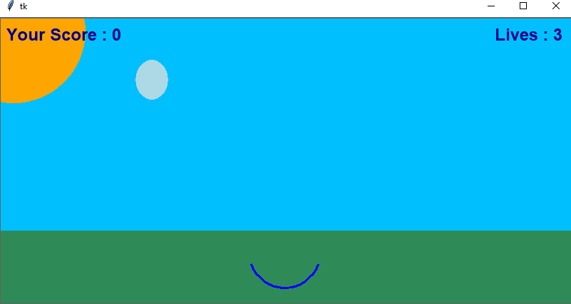
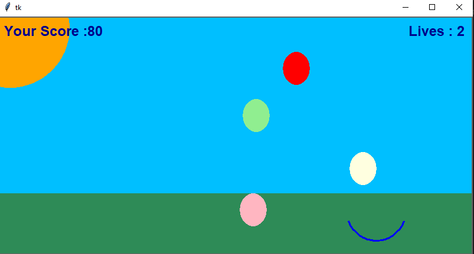
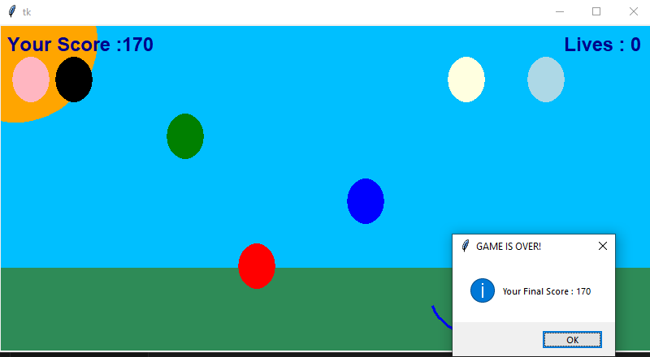

# Egg Catcher Game

<p align="justify">The Egg Catcher Game is a fun and interactive game built with Python's Tkinter library. Players control a catcher to catch falling eggs and score points. The game's background is set to a serene sky blue, with eggs of various colors dropping from the sky. The goal is to catch as many eggs as possible without letting them hit the ground.</p>


## Features

- Dynamic egg generation with random colors.
- A catcher that moves left and right to catch eggs.
- Score tracking for each egg caught.
- Life count that decreases with missed eggs.
- Increasing difficulty with faster egg drops and more frequent egg generation.

## Prerequisites

Before you run the game, make sure you have Python installed on your system. The game uses the Tkinter library, which is included with Python, so no additional package installations are required.


## Run the game script in Python:

```bash
python your-file-name.py
```

## How to Play
- 1.Use the left and right arrow keys to move the catcher and catch the falling eggs.
- 2.Try to catch as many eggs as possible to increase your score.
- 3.The game ends when you run out of lives by missing eggs.


## Controls
- Left Arrow Key: Move the catcher left.
- Right Arrow Key: Move the catcher right.


## Game Mechanics
- Eggs of various colors will fall from the top of the window.
- The player controls a catcher at the bottom to catch these eggs.
- Each caught egg increases the player's score.
- Missing an egg decreases the player's life count.
- The game gets progressively harder, with eggs falling faster and more frequently.


### Output Screen

- Initial stage of the game.
#### Starting point of the game
  

- Playing the game
#### Playing the game
   


-  End of the game
#### Ending point of the game
  